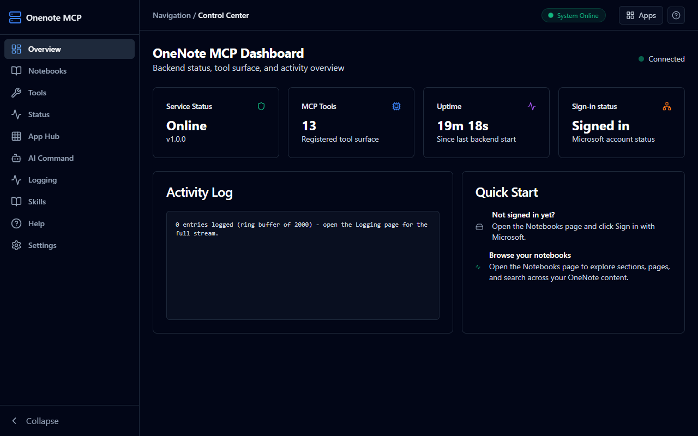
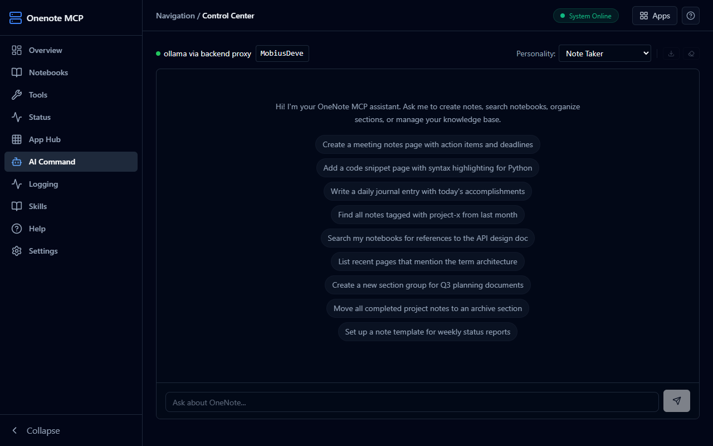

# onenote-mcp

Your OneNote notebooks, readable and writable by both you and your AI assistant.

## What this wraps

**Microsoft OneNote** via the Microsoft Graph API — notebooks, sections, and
full page content, headless (no screen automation). See [docs/WRAPPEE.md](docs/WRAPPEE.md)
for official links, community, and disambiguation from similarly-named projects.

## Preview

| Dashboard | AI Command chat |
|-----------|-----------------|
|  |  |
| Live backend status, tool surface, activity | Chat with your notes through a local LLM |

## Two doors

- **MCP server, for AI agents** — 16 tools + 1 prompt over stdio or
  streamable HTTP (`:10907/mcp`): list/explore notebooks, read page HTML,
  create pages, title + full-text search, notebook TOC cards. Any MCP client
  (Claude Desktop, Cursor, Copilot) can browse and edit your notes.
- **Webapp, for humans** — dashboard (`:10906`) with notebook tree browser,
  rendered page viewer, search with filter/sort/pagination/CSV export,
  AI chat over your notes, skills, logging, settings. No prompt engineering
  required.

## What You Can Do

- Browse notebooks → sections → pages; read full page content rendered
- Search titles instantly; build a local full-text index for body search
- Create pages from plain text (paragraphs from blank lines)
- Ask the chat about your notes (local LLM via backend proxy, nothing leaks)
- Run headless, as a Tauri desktop app, or from a `.mcpb` bundle

## Quick Install

```powershell
just bootstrap   # deps (Windows: winget installs in docs/DEVELOPMENT.md)
just serve       # backend :10907 + webapp :10906, browser opens itself
```

First run: open the Notebooks page → **Sign in with Microsoft** (free app
registration, personal accounts OK) — once. The backend renews the session
itself every hour, so you stay signed in for ~90 days without touching
anything. Full paths: [INSTALL.md](INSTALL.md),
[docs/ONBOARDING.md](docs/ONBOARDING.md).

## Example Prompts

- "Show me my OneNote notebooks"
- "Find pages mentioning quarterly planning"
- "Create a page in My Notebook titled Shopping with a bullet list"

## Documentation

| Doc | Contents |
|-----|----------|
| [Installation](INSTALL.md) | All install methods, prerequisites |
| [Onboarding](docs/ONBOARDING.md) | Microsoft account + app setup, pitfalls |
| [Wrapped app](docs/WRAPPEE.md) | OneNote links, community, disambiguation |
| [Architecture](docs/ARCHITECTURE.md) | System, auth chain, scope recipe, ports |
| [Configuration](docs/CONFIGURATION.md) | Env vars, config options |
| [Tool Reference](docs/TOOLS.md) | All 16 tools + prompt |
| [Auth investigation](docs/AUTH_INVESTIGATION.md) | The 401 odyssey: evidence, verdicts |
| [Development](docs/DEVELOPMENT.md) | Contributing, local setup |
| [Troubleshooting](docs/TROUBLESHOOTING.md) | Common issues, diagnostics |

## Requirements

- Windows 10/11 (primary), macOS/Linux for server-only use
- A Microsoft account (free; your notes stay yours)
- Claude Desktop or any MCP client (agents door); a browser (humans door)
- Python 3.10+ via `uv`, Node.js (source installs only — see INSTALL.md)

## License

MIT - see the LICENSE file for details.
